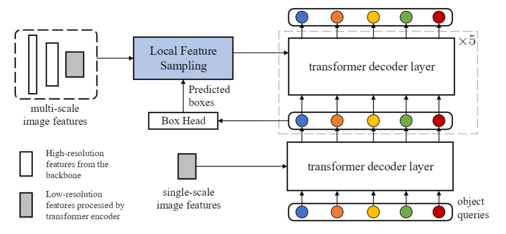
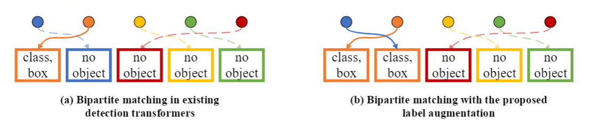

# DE-DETRs

By Wen Wang, Jing Zhang, Yang Cao, Yongliang Shen, and Dacheng Tao

This repository is an official implementation of DE-DETR and DELA-DETR in the paper [Towards Data-Efficient Detection Transformers](https://arxiv.org/abs/2203.09507), which is accepted to ECCV 2022.

For the implementation of DE-CondDETR and DELA-CondDETR, please refer to [DE-CondDETR](https://github.com/encounter1997/DE-CondDETR).

## Introduction

**TL; DR.**  We identify the data-hungry issue of existing detection transformers and alleviate it by simply alternating how key and value sequences are constructed in the cross-attention layer, with minimum modifications to the original models. Besides, we introduce a simple yet effective label augmentation method to provide richer supervision and improve data efficiency.



**Abstract.**  Detection Transformers have achieved competitive performance on the sample-rich COCO dataset. However, we show most of them suffer from significant performance drops on small-size datasets, like Cityscapes. In other words, the detection transformers are generally data-hungry. To tackle this problem, we empirically analyze the factors that affect data efficiency, through a step-by-step transition from a data-efficient RCNN variant to the representative DETR. The empirical results suggest that sparse feature sampling from local image areas holds the key. Based on this observation, we alleviate the data-hungry issue of existing detection transformers by simply alternating how key and value sequences are constructed in the cross-attention layer, with minimum modifications to the original models. Besides, we introduce a simple yet effective label augmentation method to provide richer supervision and improve data efficiency. Experiments show that our method can be readily applied to different detection transformers and improve their performance on both small-size and sample-rich datasets.



## Main Results

The experimental results and model weights trained on Cityscapes are shown below.

|       Model       | Epochs |  mAP  | mAP@50 | mAP@75 | mAP@S | mAP@M | mAP@L | Log & Model |
| :----------------: | :------: | :------: | :------: | :------: | :------: | :------: | :------: | :------: |
| DETR | 300 | 11.7 | 26.5 | 9.3 | 2.6 | 9.2 | 25.6 | [Google Drive](https://drive.google.com/drive/folders/1P1h95ZK3FB9DEDt7N045uDv7myZe4UR0?usp=sharing) |
| DE-DETR | 50 | 22.2 | 41.7 | 20.5 | 4.9 | 19.7 | 40.8 | [Google Drive](https://drive.google.com/drive/folders/1CyBraz-cjkpwYBvZ1FIfRAjpYT_ODnNf?usp=sharing) |
| DELA-DETR | 50 | 25.2 | 46.8 | 22.8 | 6.5 | 23.8 | 44.3 | [Google Drive](https://drive.google.com/drive/folders/1SpoCU01LYRAs5sLvg4VUrWA1lNm-KTS6?usp=sharing) |

The experimental results and model weights trained on COCO 2017 are shown below.

|       Model       | Epochs |  mAP  | mAP@50 | mAP@75 | mAP@S | mAP@M | mAP@L | Log & Model |
| :----------------: | :------: | :------: | :------: | :------: | :------: | :------: | :------: | :------: |
| DETR | 50 | 33.6 | 54.6 | 34.2 | 13.2 | 35.7 | 53.5 | [Google Drive](https://drive.google.com/drive/folders/1-5xHV24ZYSY2v0kKWKq3tvM8lQ1cHp0b?usp=sharing) |
| DE-DETR | 50 | 40.2 | 60.4 | 43.2 | 23.3 | 42.1 | 56.4 | [Google Drive](https://drive.google.com/drive/folders/14g4pjeGAotarT-WDMqH207s3ovKKPb3Z?usp=sharing) |
| DELA-DETR | 50 | 41.9 | 62.6 | 44.8 | 24.9 | 44.9 | 56.8 | [Google Drive](https://drive.google.com/drive/folders/1LtsTdihAOzojHsjpJmGkDmCqB0pRFCtv?usp=sharing) |

*Note:*

1. The number of queries is increased from 100 to 300 in DELA-DETR.
2. The performance of the model weights on Cityscapes is slightly different from that reported in the paper, because the results in the paper are the average of five repeated runs with different random seeds.

## Installation

### Requirements

* Linux, CUDA>=9.2, GCC>=5.4
  
* Python>=3.7
  
* PyTorch>=1.5.0, torchvision>=0.6.0 (following instructions [here](https://pytorch.org/))

* Detectron2>=0.5 for RoIAlign (following instructions [here](https://detectron2.readthedocs.io/en/latest/tutorials/install.html))

* Other requirements
    ```bash
    pip install -r requirements.txt
    ```

## Usage

### Dataset preparation

The COCO 2017 dataset can be downloaded from [here](https://cocodataset.org) and the Cityscapes datasets can be downloaded from [here](https://www.cityscapes-dataset.com/login/). The annotations in COCO format can be obtained from [here](https://drive.google.com/drive/folders/1mRrJT-CjVwNbQ6iRt4VdZguXrH9iJx9i?usp=sharing). Afterward, please organize the datasets and annotations as following:

```
data
└─ cityscapes
   └─ leftImg8bit
      |─ train
      └─ val
└─ coco
   |─ annotations
   |─ train2017
   └─ val2017
└─ CocoFormatAnnos
   |─ cityscapes_train_cocostyle.json
   |─ cityscapes_val_cocostyle.json
   |─ instances_train2017_sample11828.json
   |─ instances_train2017_sample5914.json
   |─ instances_train2017_sample2365.json
   └─ instances_train2017_sample1182.json
```

The annotations for down-sampled COCO 2017 dataset is generated using ```utils/downsample_coco.py```

### Training

#### Training DELA-DETR on Cityscapes

```bash
python -m torch.distributed.launch --nproc_per_node=2 --master_port=29501 --use_env main.py --dataset_file cityscapes --coco_path data/cityscapes --batch_size 4 --model dela-detr --repeat_label 2 --nms --num_queries 300 --wandb
```

#### Training DELA-DETR on down-sampled COCO 2017, with e.g. sample_rate=0.01

```bash
python -m torch.distributed.launch --nproc_per_node=2 --master_port=29501 --use_env main.py --dataset_file cocodown --coco_path data/coco --sample_rate 0.01 --batch_size 4 --model dela-detr --repeat_label 2 --nms --num_queries 300 --wandb
```

#### Training DELA-DETR on COCO 2017

```bash
python -m torch.distributed.launch --nproc_per_node=8 --master_port=29501 --use_env main.py --dataset_file coco --coco_path data/coco --batch_size 4 --model dela-detr --repeat_label 2 --nms --num_queries 300 --wandb
```

#### Training DE-DETR on Cityscapes

```bash
python -m torch.distributed.launch --nproc_per_node=2 --master_port=29501 --use_env main.py --dataset_file cityscapes --coco_path data/cityscapes --batch_size 4 --model de-detr --wandb
```

#### Training DETR baseline
Please refer to the [detr](https://github.com/encounter1997/DE-DETRs/tree/detr) branch.

### Evaluation

You can get the pretrained model (the link is in "Main Results" session), then run following command to evaluate it on the validation set:

```bash
<training command> --resume <path to pre-trained model> --eval
```

## Acknowledgement 

This project is based on [DETR](https://github.com/facebookresearch/detr) and [Deformable DETR](https://github.com/fundamentalvision/Deformable-DETR). Thanks for their wonderful works. See [LICENSE](./LICENSE) for more details. 


## Citing DE-DETRs
If you find DE-DETRs useful in your research, please consider citing:
```bibtex
@inproceedings{wang2022towards,
  title     =  {Towards Data-Efficient Detection Transformers},
  author    =  {Wen Wang and Jing Zhang and Yang Cao and Yongliang Shen and Dacheng Tao},
  booktitle =  {Proc. Eur. Conf. Computer Vision (ECCV)},
  year      =  {2022}
}
```
